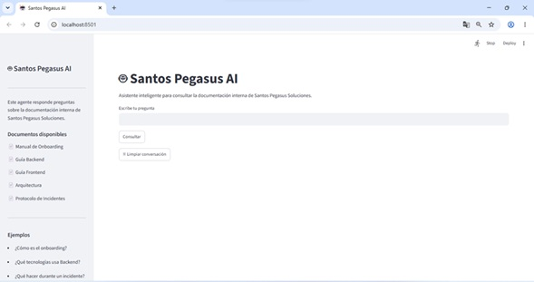
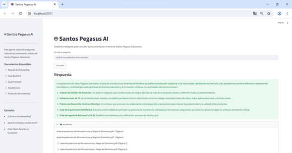
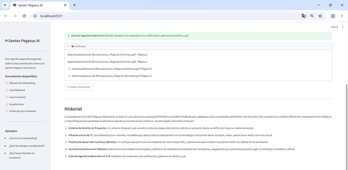

# 🤖 Santos Pegasus AI

Agente de Inteligencia Artificial desarrollado para el **Challenge Alura Agente - ONE IA FOR TECH**.

El proyecto implementa un sistema **RAG (Retrieval-Augmented Generation)** capaz de responder preguntas sobre la documentación interna de una empresa ficticia (**Santos Pegasus Soluciones**) utilizando documentos PDF como base de conocimiento.

---

## 📌 Características

- Consulta documentos en lenguaje natural.
- Procesa múltiples archivos PDF.
- Genera embeddings con Hugging Face.
- Almacena la base vectorial utilizando FAISS.
- Responde preguntas utilizando un modelo de lenguaje (Qwen 2.5 Instruct).
- Interfaz web desarrollada con Streamlit.
- Recuperación de documentos mediante Retrieval-Augmented Generation (RAG).

---

# Arquitectura

```
                PDFs
                  │
                  ▼
        PyPDFLoader (LangChain)
                  │
                  ▼
   RecursiveCharacterTextSplitter
                  │
                  ▼
 Embeddings (Sentence Transformers)
                  │
                  ▼
             FAISS Vector DB
                  │
                  ▼
             Retriever
                  │
                  ▼
        Qwen 2.5 Instruct
                  │
                  ▼
          Respuesta al usuario
```

---

# Tecnologías utilizadas

| Tecnología | Uso |
|------------|-----|
| Python | Desarrollo del proyecto |
| Streamlit | Interfaz web |
| LangChain | Pipeline RAG |
| FAISS | Base vectorial |
| Hugging Face | Embeddings y modelo LLM |
| Sentence Transformers | Embeddings |
| PyPDF | Lectura de documentos PDF |

---

# Estructura del proyecto

```
Proyecto/
│
├── app.py
├── requirements.txt
├── README.md
│
├── docs/
│   ├── Manual de Onboarding.pdf
│   ├── Guía Backend.pdf
│   ├── Guía Frontend.pdf
│   ├── Arquitectura.pdf
│   └── Protocolo Incidentes.pdf
│
├── src/
│   ├── loader.py
│   ├── prompts.py
│   └── rag.py
│
├── vector_db/
│
└── images/
```

---

# Instalación

Clonar el repositorio

```bash
git clone https://github.com/TU_USUARIO/Santos-Pegasus-AI.git

cd Santos-Pegasus-AI
```

Crear entorno virtual

```bash
python -m venv .venv
```

Activarlo

Windows

```bash
.venv\Scripts\activate
```

Linux

```bash
source .venv/bin/activate
```

Instalar dependencias

```bash
pip install -r requirements.txt
```

Ejecutar la aplicación

```bash
streamlit run app.py
```

---

# Ejemplos de preguntas

- ¿Cómo es el proceso de onboarding?
- ¿Qué tecnologías utiliza el equipo Backend?
- ¿Qué hacer cuando ocurre un incidente?
- ¿Cuál es la arquitectura utilizada por la empresa?
- ¿Cómo funciona el plan 30/60/90?

---

# Ejemplo de respuesta

**Pregunta**

> ¿Cómo es el proceso de onboarding?

**Respuesta**

> El onboarding contempla un plan progresivo de 30, 60 y 90 días. Durante la primera semana el objetivo es configurar el entorno de trabajo y conocer al equipo. La productividad completa se espera conforme avanza el plan.

**Fuentes**

- Manual de Onboarding para Nuevos Desarrolladores.pdf
- Página 31

---

# Capturas

## Página principal




## Consulta realizada




## Fuentes utilizadas



---

# Trabajo futuro

- Soporte para archivos Word.
- Soporte para Excel.
- Soporte para PowerPoint.
- Historial de conversaciones.
- Memoria conversacional.
- Integración con Oracle Cloud.
- Integración con APIs empresariales.

---

# Autor

Pablo Daniel Sauer Soria

Ingeniero en Telemática

Challenge Alura Agente - ONE IA FOR TECH
=======
# agente-ia
Agente inteligente para Santos Pegasus Soluciones (Empresa de tecnología especializada en el desarrollo de software).
